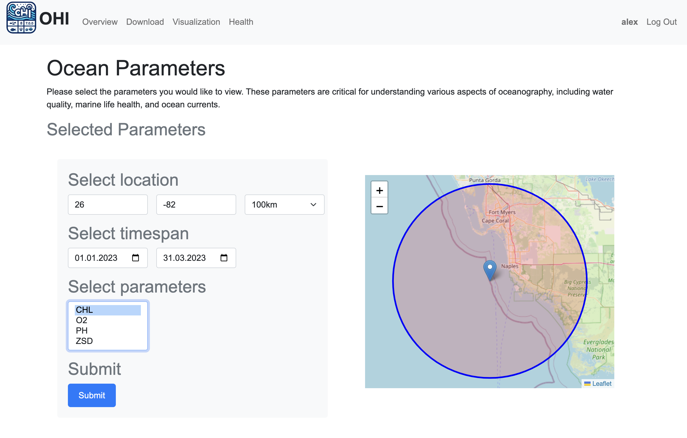
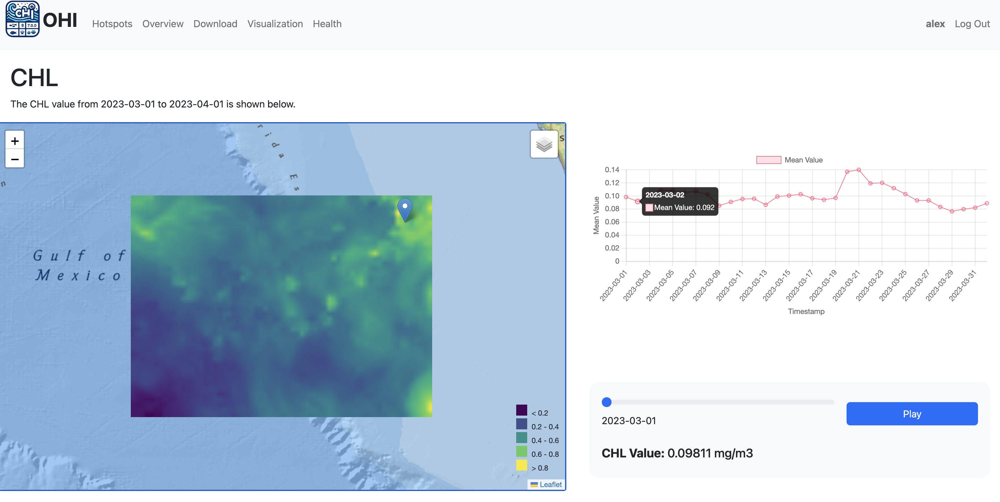
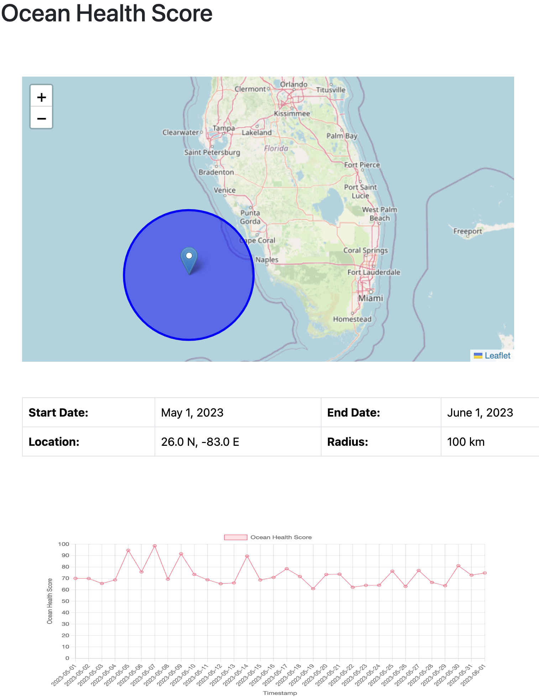

# OHI
**Ocean Health Index** web application -- a user-friendly interface for users to interact with ocean health data. It supports the following functionalities:
- Visualization of fishing hotspots clusters
- Visualization of ocean health parameters
- Visualization of ocean health scores

This web application is developed using Python and **Django** for the web framework and **Leaflet** for geospatial visualization. 

### Ocean Parameter Selection
In this site you can select the location you are interested in and download relevant ocean parameter from the **Coperinicus marine services** within your defined timespan and range. 

### Parameter Visualization
And after downloading the corresponding data, you can visualize the data in a map and investigate its spatial and temporal changes. 

### Ocean Health
With the same idea, you can visualize the Ocean Health Score with our OHI algorithm. 

